# Azure OAuth2 OIDC Auth Code Flow demonstration

The goal of this repository is to demonstrate how to incorporate [OAuth 2.0](https://datatracker.ietf.org/doc/html/rfc6749) on Azure **WITHOUT** the use of [MSAL](https://learn.microsoft.com/en-us/entra/identity-platform/msal-overview) for educational purposes.
In a production environment one should **ALWAYS** use MSAL or similar battle-tested libraries, but it is vital for any engineer to understand what is going on under the hood instead of just blindly calling a library which
automagically solves all your needs.

The repo contains code for both the client and the server. The client is utilizing [OpenID Connect (OIDC)](https://auth0.com/docs/authenticate/protocols/openid-connect-protocol) with 
Auth code flow. A comprehensive step-by-step guide is included on how to register the client and server on Azure Entra ID. 

## Requirements

- **Platform**: x86-64, Linux/WSL
- **Programming Language**: [Python 3](https://www.python.org/downloads/)
- **Azure Account**: Access to [Azure Subscription](https://azure.microsoft.com/en-us/pricing/purchase-options/azure-account)
- **IAC Tool**: [Terraform](https://www.terraform.io/) 


## Allocate resources

The script [up](up.sh) provisions Azure resources by applying our [Terraform script](infra/terraform.tf).

It is necessary to create a file named **terraform.tfvars** in the [infra](infra) directory. This file holds sensitive information
necessary for terraform to be able to interact with your cloud resources, namely that of your tenant and subscription id. 
An exemption for this file has been added in our [.gitignore](.gitignore) so that you do not accidentally commit it. 

The file structure is as follows:

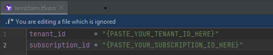


## Set up CI/CD via Deployment Center

Now that we have our new Web App resource up and running on Azure, we may proceed to set up our means of deploying our code to the
aforementioned Web App. We will do so by connecting our Web App to our GitHub repository. Azure Web Apps has the ability
to create a fully fledged CI/CD pipeline in the form of a GitHub Action Workflows script, which it commits on our behalf. As part of this pipeline a managed identify
will be created in Azure in order to authenticate requests. Secrets will be automatically created and referenced in the CI/CD script by Azure. 

Click on the **Deployment Center** section under the **Deployment** blade. Choose GitHub as source and set the appropriate organization, repository and branch.
For authentication keep it as is (user-assigned identity). Click on the **Save** button in the top left corner.

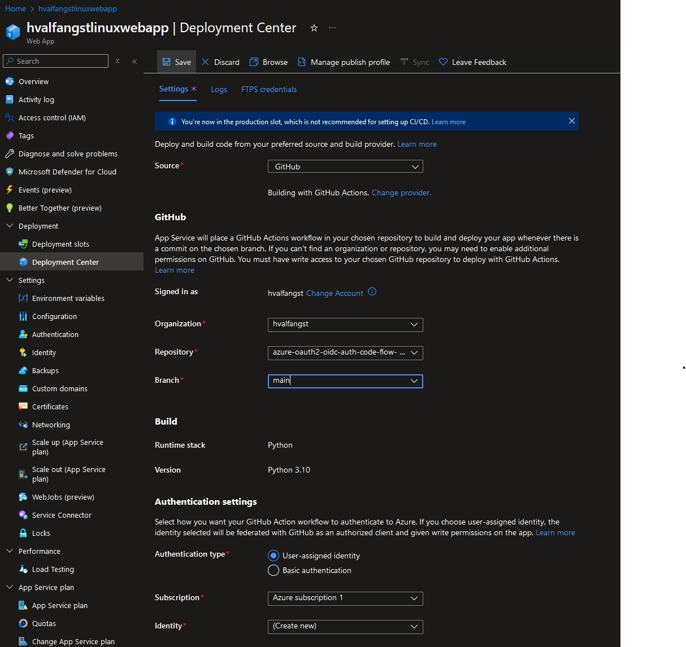

After the changes have persisted, navigate to your GitHub repository. A new commit which contains the CI/CD workflows file should be present. As mentioned earlier,
this has been committed by Azure on our behalf.

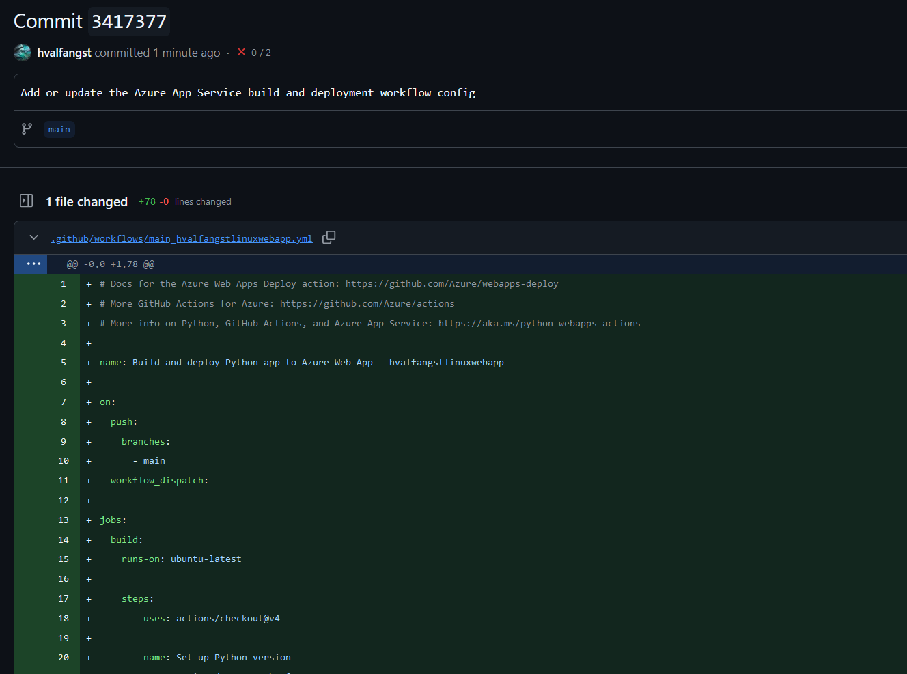

Navigate to the bottom of the workflow file. Take notice of the three secrets being referenced.

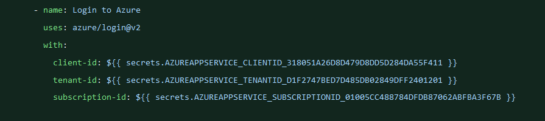

If you navigate to your secrets and variables associated with your GitHub Actions you will see that there are three new secrets, the same referenced above. Again,
these have been set by Azure on your behalf in order to set up authentication with our managed identity which was created as part of the Deployment Center rollout.

For the CI/CD workflow script to actually work, we have to make some adjustments. Remember, this repo contains code for both the client and server -
which are located in their own directories. The autogenerated script assumes that the files are located in the root folder, which is not the case here.
Thus, we need to change the script to reference files located under the server directory, as we are to deploy our server. 

The final pipeline definition should look like [this](.github/workflows/main_hvalfangstlinuxwebapp.yml).

## Deploy API 

In order to deploy our code to our Azure Web App slot, we need to trigger the newly registered GitHub Actions Workflow manually. Head over to the **Actions** section of your repository. Click on the **Run workflow** button located in the right corner.

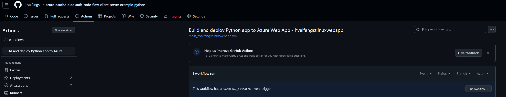

Running said action should result in the following:

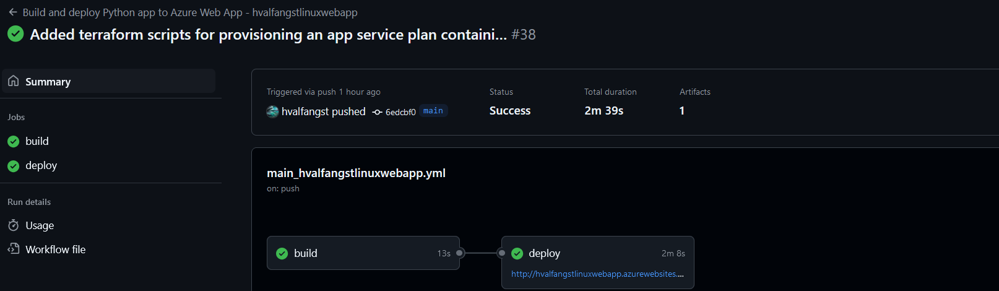

Navigate to the **Deployment Center** section of your Azure Web App. A new deployment will be visible. Commit author and message will be equal to that of GitHub.

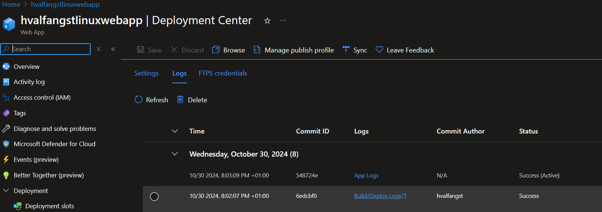

Now that we know that it deployed successfully it is finally time to access the API. Click on URI associated with **Default Domain**

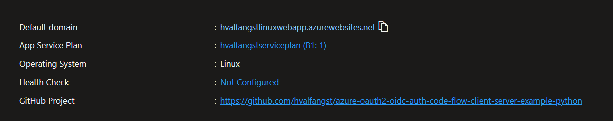

You will be prompted with the following default page, which indicates that the API is up and running.

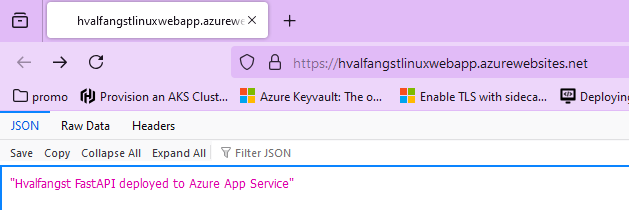


## Register API on Azure AD

Now that we have deployed our API to Azure Web Apps, we need to register it on Microsoft Entra ID.

### Create a new app registration

Navigate to the **App registrations** blade and click on **New registration** button in the top left tab

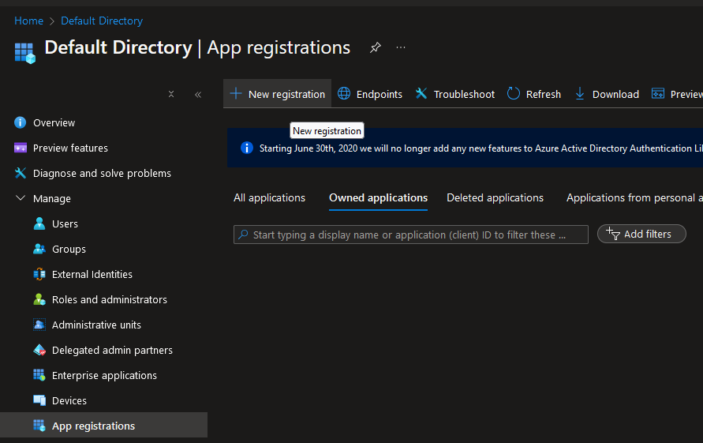

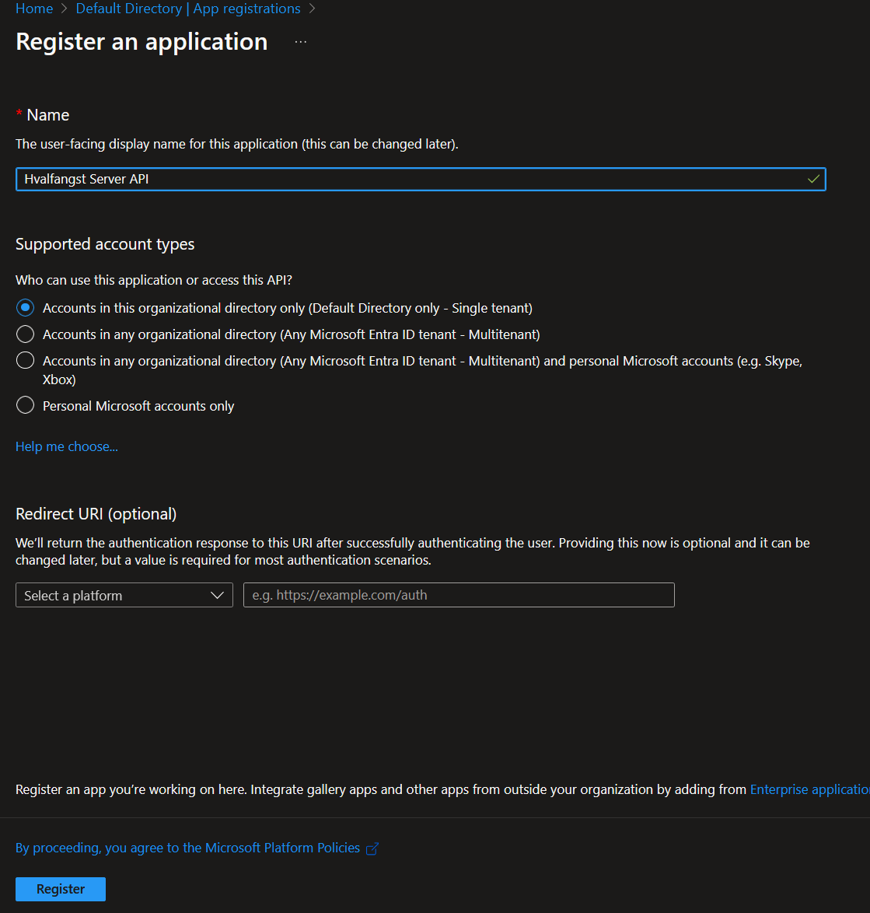

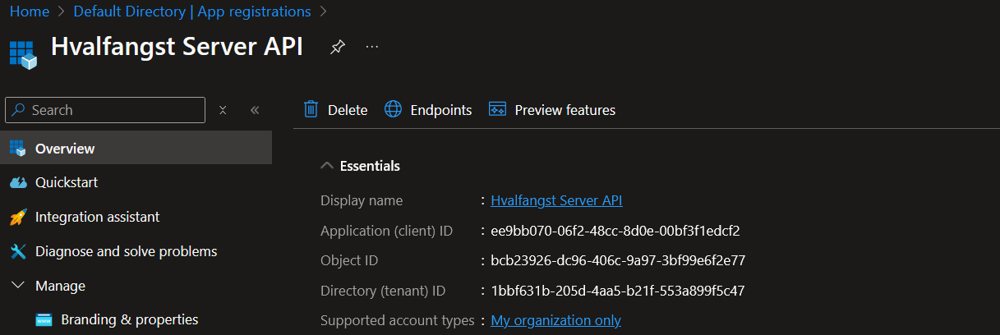


### Expose API


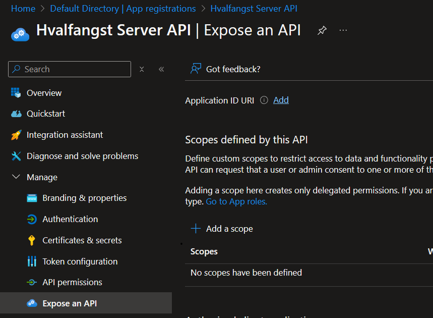


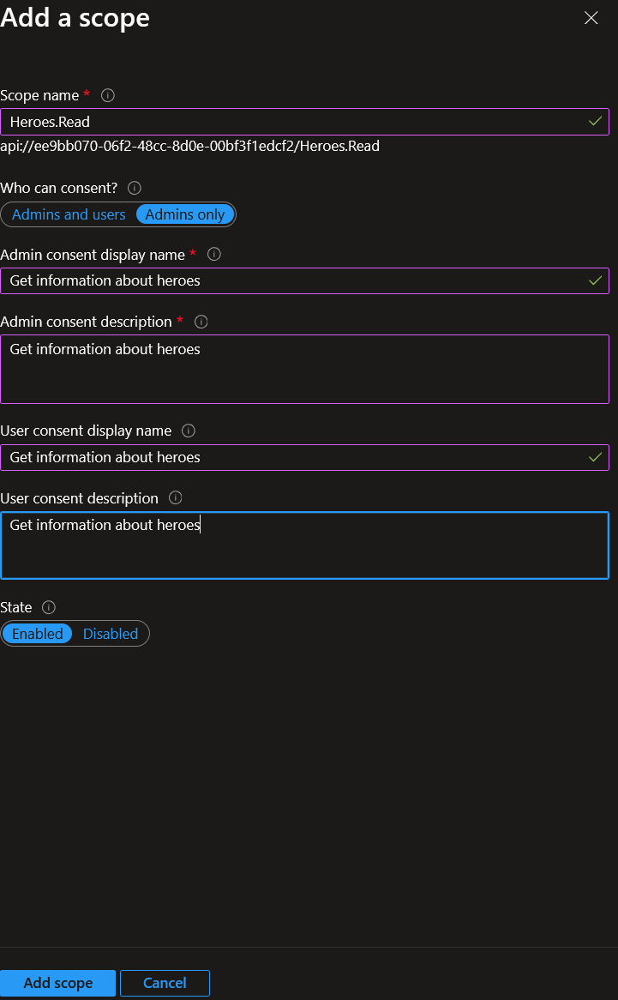

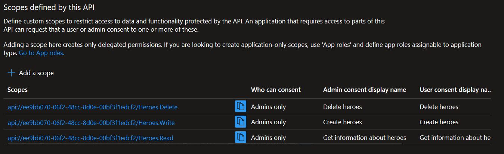


## Running API
```bash
python -m uvicorn app.main:app --reload
```
