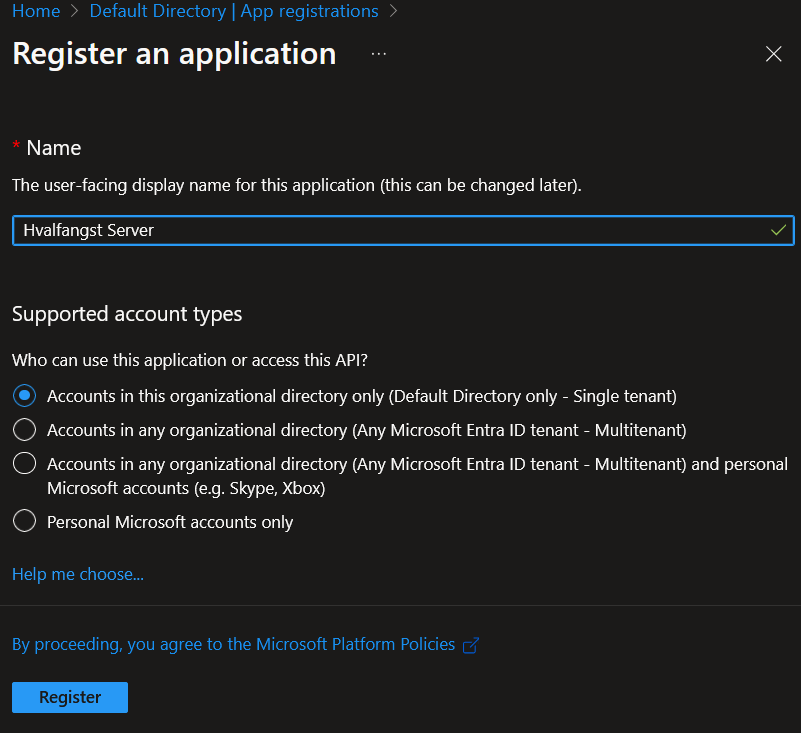
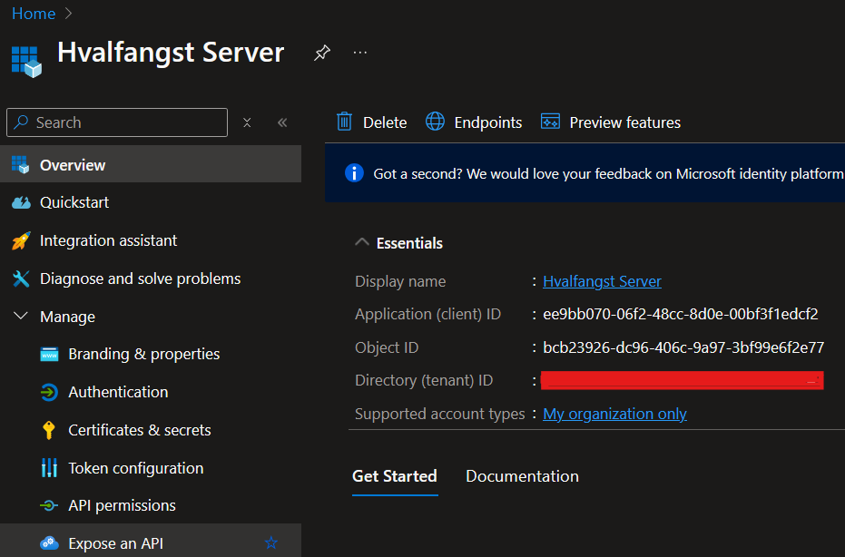
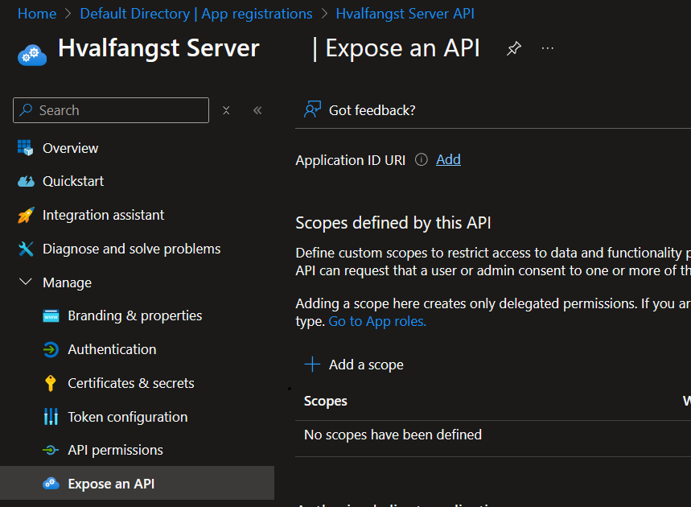
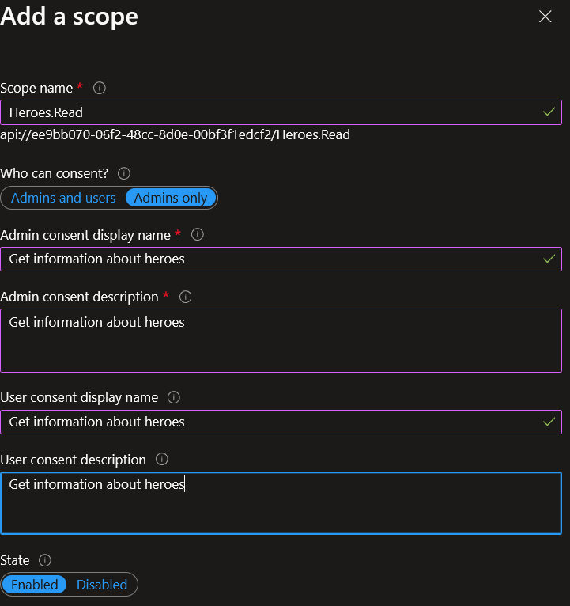
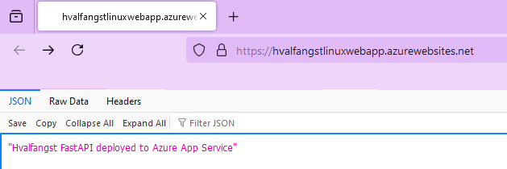
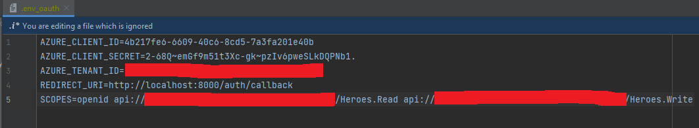
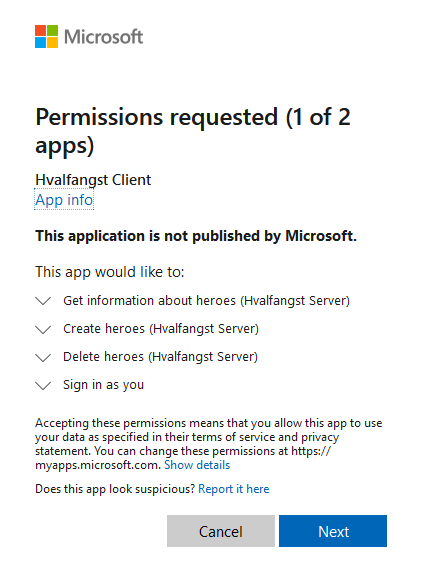
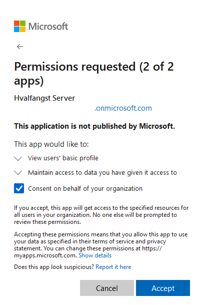
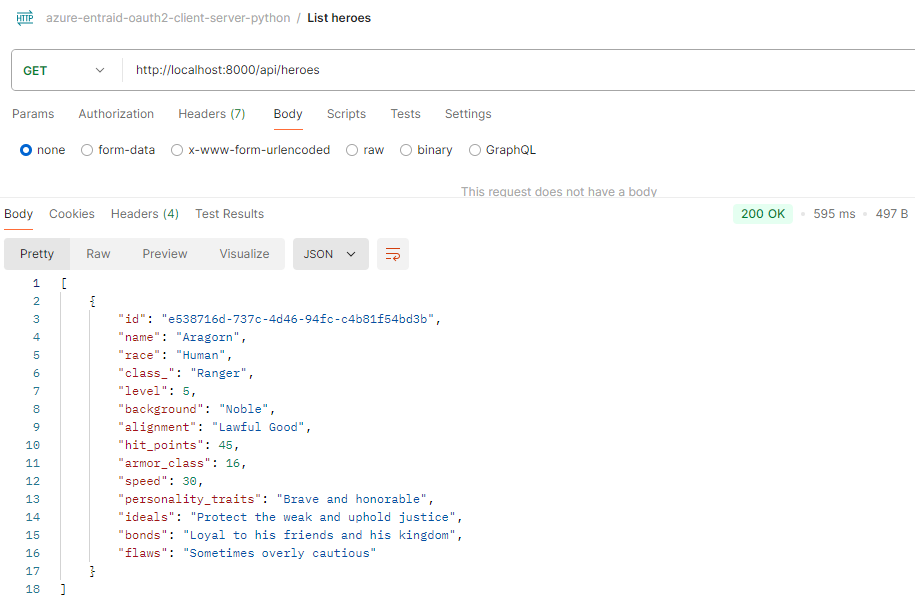

# Azure OAuth2 OIDC Auth Code Flow demonstration

The goal of this repository is to demonstrate how to incorporate [OAuth 2.0](https://datatracker.ietf.org/doc/html/rfc6749) on Azure **WITHOUT** the use of [MSAL](https://learn.microsoft.com/en-us/entra/identity-platform/msal-overview) for educational purposes.
In a production environment one should **ALWAYS** use MSAL or similar battle-tested libraries, but it is vital for any engineer to understand what is going on under the hood instead of just blindly calling a library which
automagically solves all your needs.

The repo contains code for both the client and the server. The client is utilizing [OpenID Connect (OIDC)](https://auth0.com/docs/authenticate/protocols/openid-connect-protocol) with 
Auth code flow. A comprehensive step-by-step guide is included on how to register the client and server on Azure Entra ID. 

## Requirements

- **Platform**: x86-64, Linux/WSL
- **Programming Language**: [Python 3](https://www.python.org/downloads/)
- **Azure Account**: Access to [Azure Subscription](https://azure.microsoft.com/en-us/pricing/purchase-options/azure-account)
- **IAC Tool**: [Terraform](https://www.terraform.io/) 


## Allocate resources

The script [up](up.sh) provisions Azure resources by applying our [Terraform script](infra/terraform.tf).

It is necessary to create a file named **terraform.tfvars** in the [infra](infra) directory. This file holds sensitive information
necessary for terraform to be able to interact with your cloud resources, namely that of your tenant and subscription id. 
An exemption for this file has been added in our [.gitignore](.gitignore) so that you do not accidentally commit it. 

The file structure is as follows:


## Register server on Entra ID

Before deploying our server we need to create an app registration on Entra ID. 

### Create a new app registration

Log into your Azure account on the web. Search for **Microsoft Entra ID**. Navigate to the **App registrations** blade and click on **New registration** button in the top left tab.


Choose a suitable name. Here I have chosen **Hvalfangst Server** as the registration will be utilized by an API we are to deploy to Azure Web Apps in the coming sections. The client which is to interact with our server resource will **NOT** be deployed. It will merely run locally. The fact that
both the to-be-deployed server and the local client are both Python APIs (using the FastAPI framework) may seem confusing, but this is just for demonstration purposes. The client could have been a React SPA and the sever an Axum API for all you care. We do not need to set up a redirect URI for our server. This will be done for the client in later sections. 



Once the app registration has been created, store the application and tenant id for later use. We will make use of these when setting up the CI/CD pipeline - which deploys the server API to Azure Web Apps.




### Create Scope

We will now proceed to create scopes. Scopes are in essence fully customizable access right labels, meaning that you are free to choose **ANY** name. It is, however common to conform to the following pattern: **Resource.Access**. 
Say that you have implemented a CRUD API in the domain of wines. Since the domain is wine, the prefix would naturally be **Wines**. Access levels **could** be **READ**, **WRITE** and **DELETE**.
For instance, the scope **Wines.Read** grants you access to **read** wines - which in the API translates to the right to perform any **HTTP GET** requests. Example GET requests are to list all wines and to view details about a specific wine based on ID.

Click on the **Add a scope** button under the **Expose an API** section, which is accessible from the **Expose an API** blade under **Manage**.



Set the scope name to **Heroes.Read**. Clients with this scope may list and view heroes. As for consent, choose **Admins only**.
For the remainder of fields you are free to choose whatever you find descriptive.



Repeat the above for subsequent scopes **Heroes.Write** and **Heroes.Delete**.


It goes without saying that the chosen scopes are just simple examples. Feel free to adapt as you see fit. It is also important to mention that the newly created scopes 
are absolutely junk on its own. You **must** reference the scope names exactly as defined in your [server code](server/security/auth.py) for it to have any effect.
That is, you must implement logic in your endpoints which verifies the signature associated with the token derived from the auth header, ensure that the
audience is the client id of the server app registration and that the scopes included in the decoded claims matches that of what is required for that specific endpoint.
In order to [create heroes](server/services/hero_service.py) one must have the scope **Heroes.Create** as specified in the [router](server/routers/heroes.py). 
So nothing new under the sun for those who have set up JWT-based authorization before (without magic that is, major caveat).

## Set up CI/CD via Deployment Center

Now that we have provisioned necessary infrastructure and created an app registration for the server, we may proceed to create the pipeline used to deploy our code to Azure Web Apps.
We will do so by integrating our Web App to our **GitHub repository**. Azure Web Apps has the ability
to create a fully fledged CI/CD pipeline in the form of a GitHub Action Workflows script, which it commits on our behalf. As part of this pipeline a managed identify
will be created in Azure in order to authenticate requests. Secrets will be created automatically and referenced in the CI/CD script. Once the
pipeline script has been created, we must adapt it slightly for it to work. More on this later.

Click on the **Deployment Center** section under the **Deployment** blade. Choose GitHub as source and set the appropriate organization, repository and branch.
For authentication keep it as is (user-assigned identity). Click on the **Save** button in the top left corner.


After the changes have persisted, navigate to your GitHub repository. A new commit which contains the CI/CD workflows file should be present. As mentioned earlier,
this has been committed by Azure on our behalf.


Navigate to the bottom of the workflow file. Take notice of the three secrets being referenced.


If you navigate to your secrets and variables associated with your GitHub Actions you will see that there are three new secrets, which are the same as referenced above. Again,
these have been set by Azure on your behalf in order to set up authentication with our managed identity which was created as part of the Deployment Center rollout.

For the CI/CD workflow script to -actually- work, we have to make some adjustments. Remember, this repo contains code for both the client and server -
which are located in their own directories. The autogenerated script assumes that the files are located in the root folder, which is not the case here.
Thus, we need to change the script to reference files located under the server directory, as we are to deploy our server. 

We are storing configuration values for our API in a class named [AzureConfig](server/config/config.py). Notice how the values for fields **TENANT_ID**
and **SERVER_CLIENT_ID** are retrieved from the runtime environment - which means that these environment variables must be set somehow. When running the
API locally for sake of testing one should **NOT** hardcode the associated values due to the risk of accidentally committing to SCM. Instead, you should
either set environment variables on your system or retrieve them from an .env file, which, naturally, **HAS** to be added your .gitignore.

Proceed to add two new GitHub Action secrets. These should be your **tenant ID** and the **client ID** associated with your newly created **Hvalfangst Server API** app registration.


We now need to modify our GitHub Actions Workflow script to set the environment variables in our Azure Web App itself. We do so by the use of the az CLI
command **az webapp config appsettings set** where the associated values are retrieved from our repository secrets we set above. 

## Deploy API 

In order to deploy our code, we need to perform a manual GitHub Actions trigger. Head over to the **Actions** section of your repository. Click on the **Run workflow** button located in the right corner.


Running the workflow should result in the following:


Navigate to the **Deployment Center** section of your Azure Web App. A new deployment will be visible. Commit author and message will be equal to that of GitHub.


Click on the **Environment variables** section of your Web App to ensure that the App setting environment variables **HVALFANGST_TENANT_ID** and **HVALFANGST_SERVER_CLIENT_ID**
have been set. The environment variable **SCM_DO_BUILD_DURING_DEPLOYMENT** was set by our [Terraform script](infra/terraform.tf) when creating the Azure Web App. It instructs our container to
build the virtual environment based on our [requirements](server/requirements.txt) file on deploy as opposed to utilizing some pre-built virtual environment that has been transmitted.


Now that we know that it deployed successfully it is finally time to access the API. Click on URI associated with **Default Domain**.


You will be prompted with the following index page, which indicates that the API is up and running.



The index page is available for all users and as such is not protected by any token validation logic. What is protected by token validation logic is our [heroes route](server/routers/heroes.py).
This route exposes 4 endpoints: **POST /heroes/**, **GET /heroes/**, **GET /heroes{hero_id}** and **DELETE /heroes/{hero_id}**.
Take note of how one in every endpoint start by awaiting a function called [authorize](server/security/auth.py), with the arguments **token** and a **scope**.
The scope names referenced in aforementioned function call are exactly what was defined earlier. Hence, my little
rant about scopes in and of itself being useless unless there is logic in place to actually enforce
required scopes. We will utilize our [local client](client/main.py) to make HTTP calls to the server we deployed in previous sections. But first we must register it on MS Entra ID
and assign it the appropriate permissions so that the scopes contained in its tokens  matches that of being specified in the protected server endpoints.


## Register client on Azure Entra ID

Now that have our server deployed and configured, it is time to talk about the client. As mentioned before, the client is **NOT** deployed to Azure - it is merely a local API.


### Create a new app registration

As usual, one must create a new app registration akin to what was done with the server.


Again, take note of the **Client ID**.


### Create Secret

Recall earlier when we mentioned that the server does not need secrets? Well, the client does. It is called **Client Secret** for a reason (naturally).

Head over to the **Certificates & secrets** blade. Click on the **New client secret** button.


Pick a suitable name.


Store the secret value for later.


### Add Redirect URL

Now it's time for the confusing part, or at least, as Bane would put it - **FOR YOU**.

Head over to the **Authentication** section of your client app registration. Click on **Add a platform** under **Platform configurations**. 
You will be prompted with the choice between daemon, SPA or web. Pick web.


Doing so will prompt you with yet another screen with two input fields. The first input field is for setting the redirect URI. This may also be referred to as the callback URI or the back-channel URI. More on this below. The front-channel logout URL will not be
used in this example, but is typically needed for applications which utilize Single Sign On (SSO). As for the **Implicit grant and hybrid flows**, check off both boxes so that the authorization server may issue both access and ID tokens. We do this
on purpose in order to demonstrate what goes on under the covers.


When the client application starts, it opens a browser window and directs the user to Azure's authorization endpoint. 
This prompts the user to log in with their Microsoft account and to authorize specific permissions, which in our case are **openid**, **Heroes.Read**, **Heroes.Write** and **Heroes.Delete**.
These are mandatory permissions for the Open ID Connect flow to work.
If the user successfully logs in and consents, Azure redirects the user to a pre-configured URL known as the redirect, or callback URI.
When the user authorizes the application, Azure needs a secure location to send the authorization code. The redirect URI is this location. 
The client application must "listen" at this URI to receive the code, which is necessary for exchanging it for tokens.
In practical terms, this is quite simple as one merely has to expose an HTTP endpoint in the API. In our case we have chosen the redirect URI of **http://localhost:8000/auth/callback**, 
because our client application runs locally on port 8000, the name of our router is called auth and our designated endpoint to handle the logic is named **callback**. 
As is evident from peeking at our [callback endpoint](client/routers/auth.py), it extracts a value from the query parameter named **code**. 
It then proceeds to call the OIDC flow handler function named [handle_openid_connect_flow](client/services/auth_service.py) with the aforementioned code retrieved from the authorization server in the callback endpoint. 
The OIDC function calls yet another function named **get_access_token**, which attempt to exchange our authorization code for an actual access token by issuing a POST request to the token endpoint exposed by MS Entra ID.
As may be observed, the request body must be populated with our client id & secret, the authorization code and the grant type. Access and ID tokens will be fetched from the response on success and stored in our
[token_storage](client/services/token_storage.py) class so that we may utilize the token in the endpoint associated with the [heroes router](client/routers/heroes.py). 
It goes without saying that this is just a silly example on how to easily store the tokens in-memory. The MSAL library has their own, proper, caching implementation baked in.

### Create .env file

Now we have successfully deployed our API to Azure Web Apps, set up a CI/CD pipeline, deployed our server code to the Azure Web Apps slot and configured our client and server on Microsoft Entra ID.
It is finally time to run our Client.

For the local client to work, one must create a file named **.env_oauth**, which is to hold client and tenant id, secret and callback URI. This information
may be retrieved from your Client app registration. If you forgot to copy the client secret to your clipboard you may create a new one and use that instead.
The fields will be mapped to our [OAuthSettings](client/config/oauth.py) on startup and used when making calls to the authorization server in order to obtain tokens. 

The final file should look as follows.



Note that the scopes has to be the fully-qualified unique names associated with your server app registration. That is, they should be prefixed with api://{tenant_id}.
This is only done when requesting the scopes in our initial query. In our server we merely reference the last portion, that is **Heroes.Read**.


## Running local Client API
I have included a shell script named [run_client](client/run_client.sh) which may be used to serve our API on localhost.

It may be invoked as follows:
```bash
sh client/run_client.sh
```

## Permission request
 
A new browser window will be opened on startup, which will prompt you to consent to a set of permissions. These will then in turn be set in you client app registration.

Click on **Accept**.






In this repository I have for **sake of demonstration** decided to return the decoded tokens as JSON in the
callback function - which results in this information being rendered in your browser as part of the final redirect.
This comes in handy when debugging. 

You will be prompted with the following on consenting to the above:


I have highlighted the most important parts. The URI matches that of our registered redirect URI for the client app registration.
The query parameter **code** was provided to us by the authorization server when we accepted the consent. 
It was then exchanged for actual tokens in our client's [get_access_token](client/services/auth_service.py) function.
The tokens were then [stored](client/services/token_storage.py), decoded and returned as JSON in the
final part of our [handle_openid_connect_flow](client/services/auth_service.py) function. 

The values contained in field **scp** correspond to our requested scopes of **Heroes.Read**
and **Heroes.Write**. The value contained in field **aud** under key **access_token** should match that of the Client ID of your server app registration
as this is indeed the audience of the token. Remember, we do **NOT** verify anything related to the token in our client code. Instead, we issue a POST request
to our resource server with the token. Our resource server will verify that the signature and audience before even thinking about evaluating the scopes
in order to protect endpoints.

We can now make authorized requests onto the resource server via our local API. Open up the **Postman** tool. A
Postman collection [has been provided](client/postman/azure-entraid-oauth2-client-server-python.postman_collection.json) in this repository for ease of burden.





